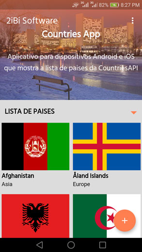
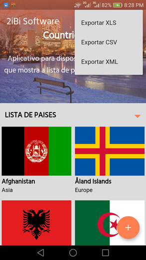
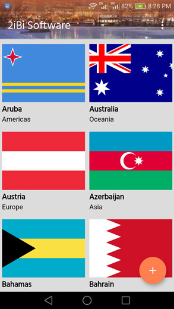
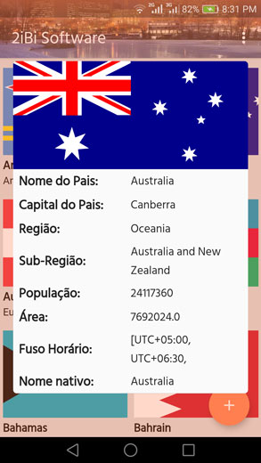
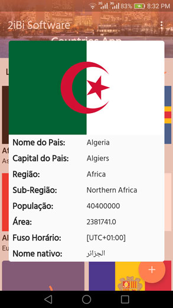

# CountriesApp para 2iBi Challenge

<p>Aplicativo mobile para sistema Android, construido com o framework <a href="https://flutter.dev/"> Flutter</a>. Efectua busca, visualização, exportação/armazenamento local de informações sobre paises, com base na API <a href="https://restcountries.eu/"> REST COUNTRIES</a>.
</p>

## Apresentação
- Gif

| GIF		|
| ------------- |
| 	|


- SCREENSHOTS

| Imagem 1  |  Imagem 2  |
| ------------------- | ------------------- |
|  |   |


| Imagem 3  |  Imagem 4  | Imagem 5 |
| ------------------- | ------------------- | ------------------- |
|   |   |   		  |

## Download Link

<a href="https://drive.google.com/file/d/19YWT_uesYgWJ72lSErkbxPlLeINuQMm1/view?usp=sharing"> Baixar Aplicativo (APK) para telemóveis com sistema Android</a>

## Funcionalidades

- [x] Busca de todos os paises na API
- [x] Visualização de informações por pais
- [x] Exportação de informações dos paises para ficheiro CSV
- [x] Exportação de informações dos paises para ficheiro XML
- [x] Armazenamento dos ficheiros na pasta do aplicativo no dispositivo
- [ ] Exportação de informações dos paises para ficheiro XLS


## Inicialização do projecto

1. Instalar o flutter 

```git clone https://github.com/AlmirandoJr/countriesApp.git```


2. Clonar o repósitorio

```git clone https://github.com/AlmirandoJr/countriesApp.git```

3. Executar

```flutter pub get```  
```flutter run --profile```